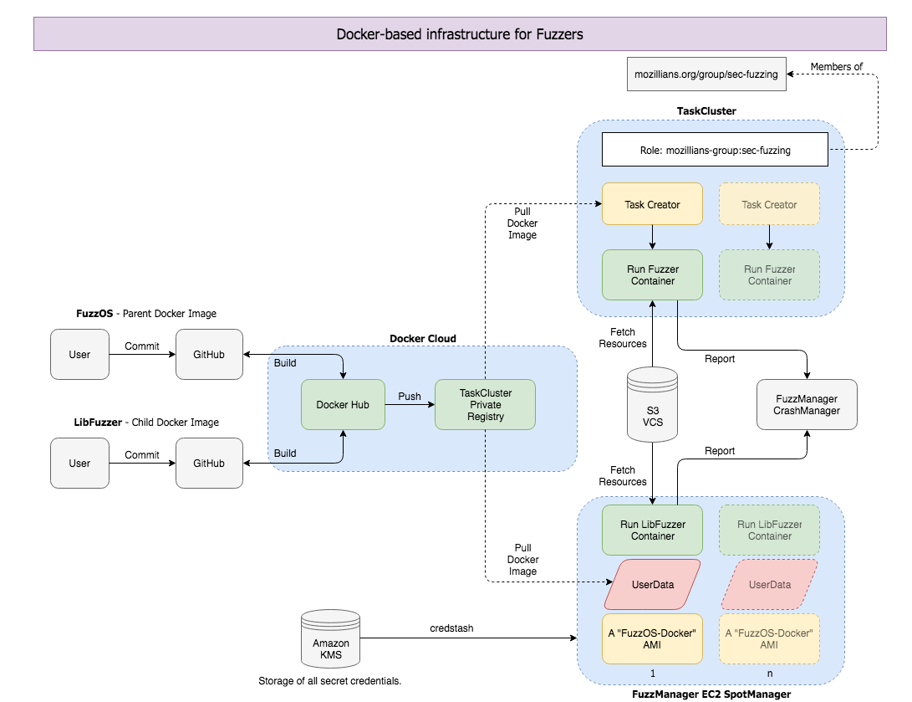

<p align="center">
  
</p>

<p align="center">
  Monorepo for building and publishing multiple Docker containers as microservices within a single repository.
</p>
<p align="center">
<a href="https://travis-ci.org/MozillaSecurity/orion"></a>
<a href="https://www.irccloud.com/invite?channel=%23fuzzing&amp;hostname=irc.mozilla.org&amp;port=6697&amp;ssl=1"></a>
<br/><br/>
FuzzOS<br>
  <a href="https://microbadger.com/images/mozillasecurity/fuzzos"></a>
</p>

## Table of Contents

- [Table of Contents](#table-of-contents)
  - [What is Orion?](#what-is-orion?)
  - [How does it operate?](#how-does-it-operate?)
  - [Build Instructions](#build-instructions-and-development)
    - [Usage](#usage)
    - [Testing](#testing)
  - [Architecture](#architecture)

### What is Orion?

Orion is a build environment for services we run in our Fuzzing infrastructure (i.e [LibFuzzer](https://github.com/MozillaSecurity/orion/tree/master/services/libfuzzer)) and home of [FuzzOS](https://github.com/MozillaSecurity/orion/tree/master/base/fuzzos) a multipurpose image which most of our fuzzing services use as a base.

> For spawning a cluster of Docker containers at EC2 or other cloud providers, see the parent project [Laniakea](https://github.com/MozillaSecurity/laniakea/).

### How does it operate?

CI and CD are performed autonomous with Travis and the Monorepo manager script. A build process gets initiated only if a file of a particular service has been modified and only than that service will be rebuild; other services are not affected from the build service at the time except during cron tasks where all images are rebuild. Each image is either tagged with the latest `revision`, `nightly` or `latest` before being published to the [Docker registry](https://hub.docker.com/u/mozillasecurity/). For more information about each service take a look in the corresponding README.md of each service or check out the [Wiki](https://github.com/MozillaSecurity/orion/wiki) pages for FAQs and a Docker cheat sheet.

### Build Instructions and Development

#### Usage

```
make help
```

#### Testing

Before a build task is initiated in Travis CI, each Shellscript and Dockerfile undergo a linting process which may or may not abort each succeeding task. To ensure your Dockerfile passes, you are encouraged to run `make lint` before pushing your commit.

Each service folder may contain a `tests` folder in which [Container Structure Tests](https://github.com/GoogleContainerTools/container-structure-test) are defined. The Monorepo Manager will run these tests with the `-test` flag set in the CI after the build process is completed and before deploying the images to the registry. To ensure your modifications to a Dockerfile and/or recipes did not cause breakage, you are encouraged to run `make test` before pusing your commit.

### Architecture

[](https://raw.githubusercontent.com/MozillaSecurity/orion/master/docs/assets/overview.png)
